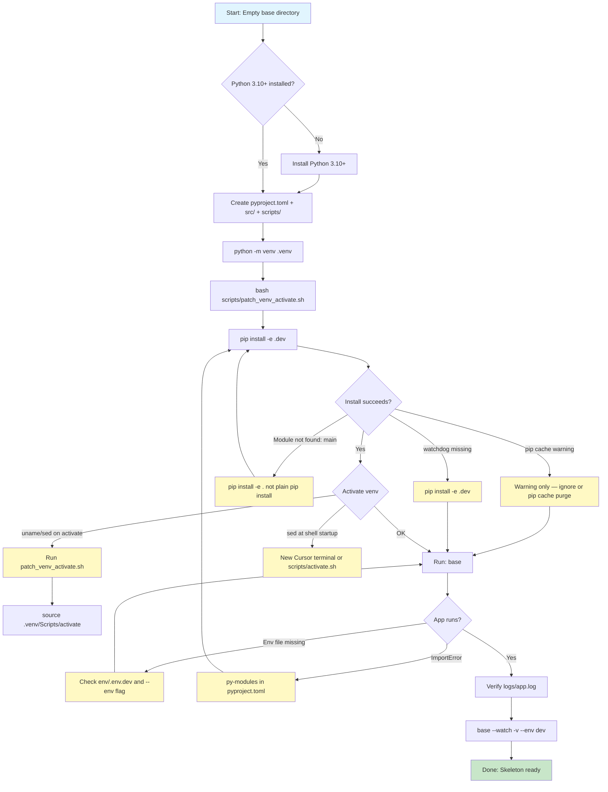

# Setup Challenges and Fixes

Issues encountered while setting up the **base** skeleton (from an empty directory), and how each was resolved.

---

## Challenge overview (flowchart)



---

## Challenge 1: Empty workspace

**Problem:** The `base` directory existed but had no project files.

**Fix:** Created full skeleton from the **practice** project pattern:

- `pyproject.toml`, `src/`, `env/`, `logs/`, `.gitignore`, `scripts/`, `.vscode/`

**Status:** Resolved

---

## Challenge 2: Matching practice project structure

**Problem:** User wanted the same skeleton features as **practice** (envs, watch, logs) but reusable and renameable.

**Fix:**

| practice | base skeleton |
|----------|---------------|
| `PRACTICE_DEV_SERVE` | `APP_DEV_SERVE` (generic) |
| LangChain deps | Removed — skeleton stays minimal |
| No file logs | Added `logs/app.log` via `FileHandler` |
| `ai_main.py` | Replaced with simple `app.py` |

**Status:** Resolved

---

## Challenge 3: pip cache warning during install

**Problem:** During `pip install -e ".[dev]"`:

```
WARNING: Cache entry deserialization failed, entry ignored
```

**Fix:** Warning is non-fatal. Install completed successfully. If install fails, clear cache:

```bash
pip cache purge
pip install -e ".[dev]"
```

**Status:** Resolved (warning only)

---

## Challenge 4: Watch mode requires watchdog

**Problem:** Running `base --watch` without dev dependencies:

```
Error: --watch requires watchdog. Install with: pip install -e ".[dev]"
```

**Fix:** Install with the dev extra:

```bash
pip install -e ".[dev]"
```

**Status:** Resolved

---

## Challenge 5: Child process module resolution in watch mode

**Problem:** Watch mode spawns `python -m main` with `cwd=src`. Child must find `main`, `app`, `core`, `load_env`.

**Fix:**

1. Editable install (`pip install -e .`) registers modules globally.
2. Parent sets `PYTHONPATH` to `src/` when spawning child.
3. Child sets `APP_DEV_SERVE=1` to stay alive until file change or Ctrl+C.

**Status:** Resolved

---

## Challenge 6: Environment file not found

**Problem:** `load_env` logs warning if `env/.env.<name>` is missing.

**Fix:** Ensure files exist:

```
env/.env.dev
env/.env.qa
env/.env.prod
```

Use `--env dev|qa|prod` to select which file loads.

**Status:** Resolved

---

## Challenge 7: `sed` / `uname: command not found` (Git Bash / Cursor)

**Problem:** In Cursor’s Git Bash terminal:

```
bash: sed: command not found
bash: uname: command not found
```

Venv may still show `(.venv)`, but errors are confusing and PATH can be wrong.

**Cause (two sources):**

| Source | When | Why |
|--------|------|-----|
| Python `activate` | On `source .venv/Scripts/activate` | Stock script calls `uname` and `cygpath` |
| User `~/.bashrc` | As soon as terminal opens | Short `PATH` without `C:\Program Files\Git\usr\bin` |

**Fix:**

1. **Patch activate** (bash builtins only, no `uname`/`dirname`):
   ```bash
   bash scripts/patch_venv_activate.sh
   source .venv/Scripts/activate
   ```
   Re-run patch after every `python -m venv .venv`.

2. **Wrapper** (adds Git to PATH, then activates):
   ```bash
   source scripts/activate.sh
   ```

3. **Cursor terminal** — `.vscode/settings.json` sets profile **Git Bash (base)** with Git `usr\bin` on `PATH`. Close old terminals; open a new one.

4. **Manual PATH** (per session):
   ```bash
   export PATH="/c/Program Files/Git/usr/bin:/c/Program Files/Git/bin:$PATH"
   ```

5. **PowerShell** — no bash dependency:
   ```powershell
   .\.venv\Scripts\Activate.ps1
   ```

6. **Skip activate:**
   ```bash
   .venv/Scripts/base --watch --env dev -v
   ```

**Status:** Resolved (patched activate + scripts + `.vscode/settings.json`)

---

## Challenge 8: Renaming project for reuse

**Problem:** Skeleton named `base` must be copyable to any new project name.

**Fix:** Full guide in [RENAME.md](RENAME.md) (required vs optional files, venv steps, copy-paste checklist).

**Status:** Resolved (documented)

---

## Quick troubleshooting table

| Symptom | Likely cause | Fix |
|---------|--------------|-----|
| `uname: command not found` on activate | Unpatched `activate` | `bash scripts/patch_venv_activate.sh` |
| `sed: command not found` at shell open | `~/.bashrc` + short PATH | New Cursor terminal or `source scripts/activate.sh` |
| `base: command not found` | Venv not activated / not installed | `pip install -e ".[dev]"` or `.venv/Scripts/base` |
| `--watch` error | watchdog not installed | `pip install -e ".[dev]"` |
| No env vars loaded | Wrong/missing env file | Check `env/.env.dev` and `--env` flag |
| Empty `logs/` | App not run yet | Run `base` once; check `logs/app.log` |
| Stats error on `foo` | Invalid input | Pass numeric values only |
| Patch needed again | Recreated `.venv` | `bash scripts/patch_venv_activate.sh` |

---

## Setup verification checklist

- [x] `python -m venv .venv` created
- [x] `bash scripts/patch_venv_activate.sh` applied
- [x] `source .venv/Scripts/activate` without `uname` error
- [x] `pip install -e ".[dev]"` succeeded
- [x] `base` runs default app
- [x] `base 10 20 30` prints stats
- [x] `base -v --env qa` loads QA env
- [x] `logs/app.log` contains log output
- [x] `base --watch --env dev` starts without ImportError
