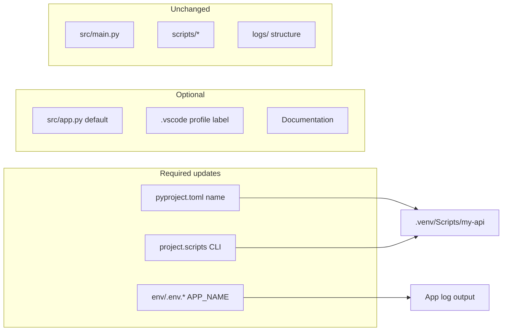

# Renaming the Project / Using as a Skeleton

This guide explains what happens when you **rename the folder** vs when you **rename the project** (package name, CLI command, and config). Use it when copying `base` to a new app or keeping a generic template.

---

## Folder rename vs project rename


| Action                                          | What changes                                 | What stays the same                                      |
| ----------------------------------------------- | -------------------------------------------- | -------------------------------------------------------- |
| **Rename folder only** (e.g. `base` → `my-api`) | Directory path on disk                       | CLI still runs as `base` until you edit `pyproject.toml` |
| **Full project rename**                         | Package name, CLI command, `APP_NAME` in env | Source layout (`src/`, `env/`, `logs/`) stays the same   |


**Summary:** Renaming the directory is fine for organization. For a **new application name and CLI**, you must update config files and reinstall the virtual environment.

---

## What you must update

Example: new project name `**my-api`**, CLI command `**my-api**`.


| Priority        | File                                                       | What to change                                                                                           |
| --------------- | ---------------------------------------------------------- | -------------------------------------------------------------------------------------------------------- |
| **Required**    | `pyproject.toml`                                           | `[project] name = "my-api"`                                                                              |
| **Required**    | `pyproject.toml`                                           | `[project.scripts]` → `my-api = "main:main"`                                                             |
| **Required**    | `env/.env.dev`                                             | `APP_NAME=my-api`                                                                                        |
| **Required**    | `env/.env.qa`                                              | `APP_NAME=my-api`                                                                                        |
| **Required**    | `env/.env.prod`                                            | `APP_NAME=my-api`                                                                                        |
| **Recommended** | `pyproject.toml`                                           | `authors`, `description` (optional)                                                                      |
| **Optional**    | `src/app.py`                                               | Default fallback: `os.environ.get("APP_NAME", "base")` → `"my-api"` (env files override this at runtime) |
| **Optional**    | `.vscode/settings.json`                                    | Profile label `"Git Bash (base)"` → `"Git Bash (my-api)"` (cosmetic only)                                |
| **Optional**    | `README.md`, `SETUP.md`, `SETUP_STEPS.md`, `CHALLENGES.md` | Examples and titles (only if you want docs to match the new name)                                        |


### `pyproject.toml` example

```toml
[project]
name = "my-api"
# ...
authors = [{ name = "Your Name" }]

[project.scripts]
my-api = "main:main"
```

### Environment files example

```bash
# env/.env.dev (and .env.qa, .env.prod)
APP_NAME=my-api
```

---

## What you do not need to change

These files are **name-agnostic** and work after a rename without edits:


| Path                             | Why                                    |
| -------------------------------- | -------------------------------------- |
| `src/main.py`                    | No hardcoded project name              |
| `src/load_env.py`                | Loads `env/.env.<ENVIRONMENT>` by path |
| `src/core.py`                    | Generic business logic                 |
| `scripts/patch_venv_activate.sh` | Uses paths relative to project root    |
| `scripts/activate.sh`            | Uses paths relative to project root    |
| `logs/`                          | Same for any project name              |
| `env/` layout                    | Same file names (`.env.dev`, etc.)     |


Environment variable `APP_DEV_SERVE` is generic (not tied to `base`).

---

## Step-by-step: copy skeleton to a new project

Replace `my-api` with your project name.

### 1. Copy the folder

```bash
cp -r base my-api
cd my-api
```

Or rename in Explorer: `base` → `my-api`.

#### What to skip when copy-pasting


| Directory          | Skip when copying?    | Why                                                                                                                                                                           |
| ------------------ | --------------------- | ----------------------------------------------------------------------------------------------------------------------------------------------------------------------------- |
| `**.venv/**`       | **Yes — always skip** | Tied to the old folder path and package name (`base`). Contains machine-specific binaries. Create a fresh venv in the new project.                                            |
| `**.vscode/`**     | **Optional**          | Not required for the app to run. Helpful in Cursor (Git Bash PATH + profile). Copy if you want the same terminal setup; skip if you use PowerShell or will set PATH yourself. |
| `**logs/*.log`**   | **Yes**               | Runtime files; recreated when you run the app.                                                                                                                                |
| `**__pycache__/`** | **Yes**               | Auto-generated.                                                                                                                                                               |


**Minimum copy:** `src/`, `env/`, `scripts/`, `logs/.gitkeep`, `pyproject.toml`, `.gitignore`, and docs (`README.md`, `SETUP*.md`, etc.).

**After copy (required):**

```bash
cd my-api
python -m venv .venv
bash scripts/patch_venv_activate.sh
pip install -e ".[dev]"
```

### 2. Edit required files

1. `**pyproject.toml**`
  - `name = "my-api"`
  - `[project.scripts]` → `my-api = "main:main"`
2. `**env/.env.dev**`, `**env/.env.qa**`, `**env/.env.prod**`
  - `APP_NAME=my-api`

### 3. Recreate virtual environment (recommended)

Old `.venv` was built for package name `base` and installs a `base` executable. A fresh venv avoids confusion.

```bash
rm -rf .venv
python -m venv .venv
bash scripts/patch_venv_activate.sh
source .venv/Scripts/activate    # Git Bash
# .\.venv\Scripts\Activate.ps1   # PowerShell
python -m pip install --upgrade pip
pip install -e ".[dev]"
```

### 4. Verify

```bash
my-api
my-api -v --env dev
my-api 10 20 30
my-api --watch --env dev -v
```

Expected log line (example):

```
[INFO] app: App started | name=my-api | environment=dev | log_level=DEBUG
```

### 5. Optional cleanup

- Update `README.md` title and examples.
- Rename Cursor profile in `.vscode/settings.json` if you use it.
- Remove or rewrite setup docs if this copy is a real app, not a template.

---

## If you keep the existing `.venv`

You can avoid deleting `.venv` if you only changed `pyproject.toml` and env files:

```bash
source .venv/Scripts/activate
pip install -e ".[dev]"
```

Then run the **new** CLI name (`my-api`). The old `base` command may remain in `.venv/Scripts/` until you reinstall; ignore or delete it.

Still run after any `python -m venv .venv`:

```bash
bash scripts/patch_venv_activate.sh
```

---

## Two common workflows


| Goal                         | Folder name                      | File updates                                      | CLI      |
| ---------------------------- | -------------------------------- | ------------------------------------------------- | -------- |
| **Keep as generic skeleton** | `base` or `skeleton`             | None required                                     | `base`   |
| **Start a real application** | e.g. `my-api`, `billing-service` | `pyproject.toml` + `APP_NAME` in all `env/.env.`* | `my-api` |


### Keep as skeleton (template)

- Leave folder as `base` (or rename to `skeleton` for clarity only).
- Do **not** change `pyproject.toml` if you want the template to stay `base`.
- For each new app: **copy** the folder, then follow [Step-by-step](#step-by-step-copy-skeleton-to-a-new-project) on the copy.

### Start a real project

- Copy `base` → `your-project-name`.
- Update required files in the table above.
- New venv + `pip install -e ".[dev]"`.
- Customize `src/app.py` with your logic.

---

## Rename checklist (copy-paste)

Use when creating a new project from this skeleton:

```
[ ] Copy folder: base → _______________
[ ] pyproject.toml: [project] name
[ ] pyproject.toml: [project.scripts] CLI entry
[ ] env/.env.dev:   APP_NAME
[ ] env/.env.qa:    APP_NAME
[ ] env/.env.prod:  APP_NAME
[ ] (optional) src/app.py: default APP_NAME fallback
[ ] (optional) .vscode/settings.json: terminal profile label
[ ] rm -rf .venv && python -m venv .venv
[ ] bash scripts/patch_venv_activate.sh
[ ] pip install -e ".[dev]"
[ ] Run: <new-cli-name>
[ ] Run: <new-cli-name> --watch --env dev -v
```

---

## Quick reference: where names appear




---

## Related documentation


| File                             | Contents                               |
| -------------------------------- | -------------------------------------- |
| [SETUP.md](SETUP.md)             | Setup commands and project layout      |
| [SETUP_STEPS.md](SETUP_STEPS.md) | Full setup walkthrough                 |
| [CHALLENGES.md](CHALLENGES.md)   | Troubleshooting (Git Bash, watch mode) |
| [README.md](README.md)           | Project overview                       |


